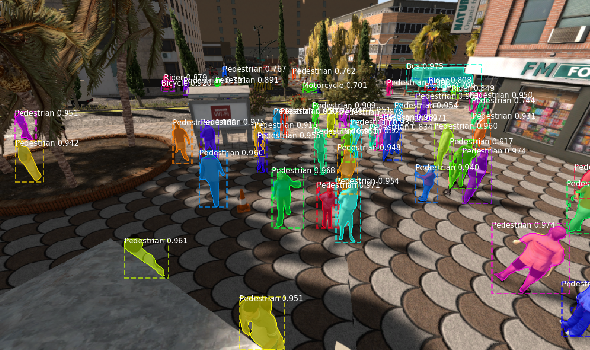
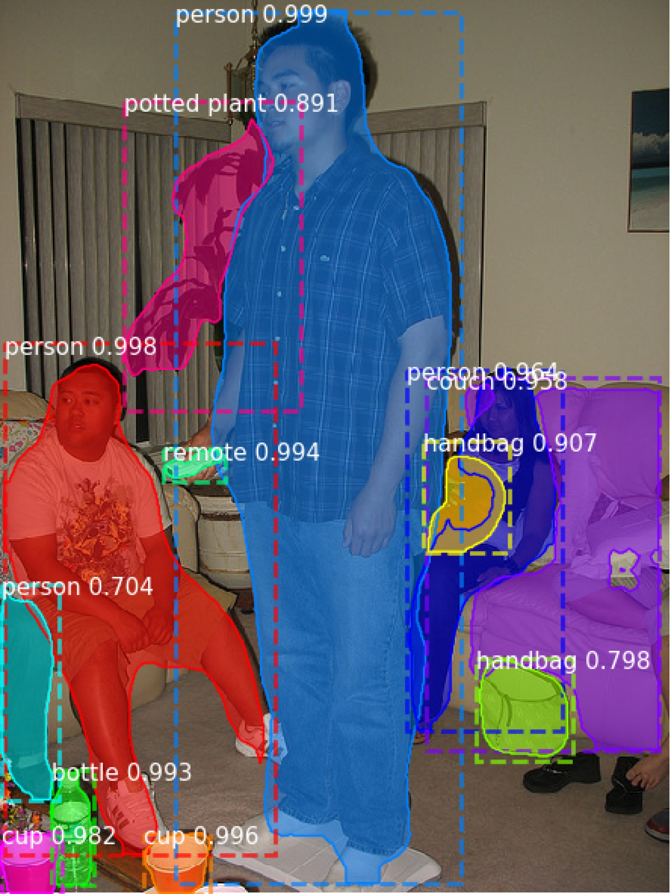

# Mask_RCNN_Pytorch

This is an implementation of the instance segmentation model [Mask R-CNN](https://arxiv.org/abs/1703.06870) on Pytorch, based on the previous work of [Matterport](https://github.com/matterport/Mask_RCNN) and [lasseha](https://github.com/multimodallearning/pytorch-mask-rcnn).  Matterport's repository is an implementation on Keras and TensorFlow while lasseha's repository is an implementation on Pytorch.

## Features
Compared with other PyTorch implementations, this repository has the following features:
* It supports multi-image batch training (i.e., batch size >1).
* It supports PyTorch 0.4.0 (Currently does not support Pytorch >1.0).
* It supports both GPU and CPU. You can use a CPU to visualize the results.
* It supports multiple GPUs training (please look at instrctions [here](https://github.com/jytime/Mask_RCNN_Pytorch/blob/05053cbd00d1dde2ae7edd59f276d1560ce9fe1f/synthia.py#L278)).
* You could train Mask R-CNN on your own dataset (please see [synthia.py](https://github.com/jytime/Mask_RCNN_Pytorch/blob/master/synthia.py), which demonstrates how we trained a model on [Synthia Dataset](http://synthia-dataset.net/), starting from the model pre-trained on COCO Dataset).
* You could use a model pre-trained on COCO or ImageNet to segment objects in your own images (please see [demo_coco.py](https://github.com/jytime/Mask_RCNN_Pytorch/blob/master/demo_coco.py) or [demo_synthia.py](https://github.com/jytime/Mask_RCNN_Pytorch/blob/master/demo_synthia.py)).

## Requirements
* Python 3
* Linux
* PyTorch 0.4.0
* matplotlib, scipy, skimage, h5py, numpy

## Demo
### [Synthia Dataset](http://synthia-dataset.net/)

### [COCO dataset](http://cocodataset.org/#home)

## Compilation
The instructions come from lasseha's repository.
* We use the [Non-Maximum Suppression](https://github.com/ruotianluo/pytorch-faster-rcnn) from ruotianluo and the [RoiAlign](https://github.com/longcw/RoIAlign.pytorch) from longcw. Please follow the instructions below to build the functions.

        cd nms/src/cuda/
        nvcc -c -o nms_kernel.cu.o nms_kernel.cu -x cu -Xcompiler -fPIC -arch=arch
        cd ../../
        python build.py
        cd ../

        cd roialign/roi_align/src/cuda/
        nvcc -c -o crop_and_resize_kernel.cu.o crop_and_resize_kernel.cu -x cu -Xcompiler -fPIC -arch=arch
        cd ../../
        python build.py
        cd ../../
        
         
    where 'arch' is determined by your GPU model: 
    
    | GPU  | TitanX | GTX 960M | GTX 1070 | GTX 1080 (Ti) |
    | :--: | :--:   | :--:     | :--:     | :--: |
    | arch | sm_52  |sm_50     |sm_61     |sm_61 |
* If you want to train the network on the [COCO dataset](http://cocodataset.org/#home), please install the [Python COCO API](https://github.com/cocodataset/cocoapi) and create a symlink.

        ln -s /path/to/coco/cocoapi/PythonAPI/pycocotools/ pycocotools
* The pretrained models on COCO and ImageNet are available [here](https://drive.google.com/open?id=1LXUgC2IZUYNEoXr05tdqyKFZY0pZyPDc).  

## Results(COCO)
The training and evaluation is based on COCO Dataset 2014. To understand the indicators below, please have a look at [pycocotools](https://github.com/cocodataset/cocoapi/tree/master/PythonAPI/pycocotools).
Notably, I only used one GTX 1080 (Ti). I think the performance could be improved if more GPUs are available.

 |       Indicator        |       IoU            | area   |        maxDets         | Value|
 |       :--:             |                 :--: | :--:   |:--:                    | :--: |
 |Average Precision  (AP) | 0.50:0.95            |   all  | 100                    | 0.392|
 |Average Precision  (AP) | 0.50                 |  all   | 100                    | 0.574|
 |Average Precision  (AP) | 0.75                 |   all  | 100                    | 0.434|
 |Average Precision  (AP) | 0.50:0.95            | small  | 100  | 0.199|
 |Average Precision  (AP) | 0.50:0.95            | medium | 100  | 0.448|
 |Average Precision  (AP) | 0.50:0.95            | large  | 100  | 0.575|
 |Average Recall     (AR) | 0.50:0.95            |   all  | 1  | 0.321|
 |Average Recall     (AR) | 0.50:0.95            |   all  | 10  | 0.445|
 |Average Recall     (AR) | 0.50:0.95            |  all   | 100  | 0.457|
 |Average Recall     (AR) | 0.50:0.95            | small  | 100  | 0.231|
 |Average Recall     (AR) | 0.50:0.95            | medium | 100  | 0.508|
 |Average Recall     (AR) | 0.50:0.95            | large  | 100  | 0.645|
 
